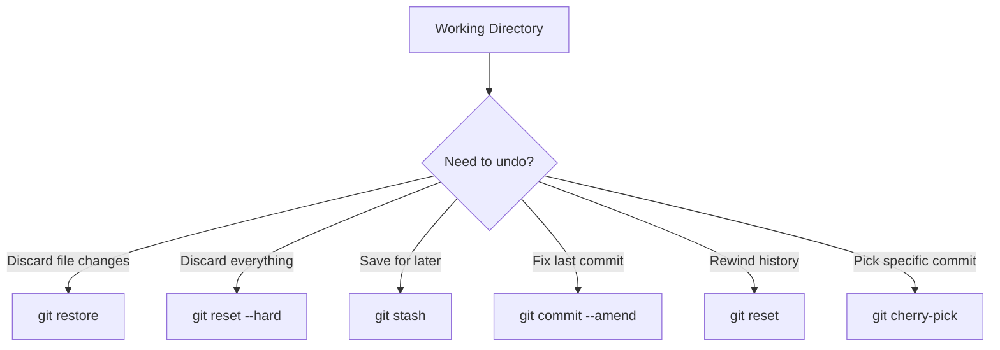
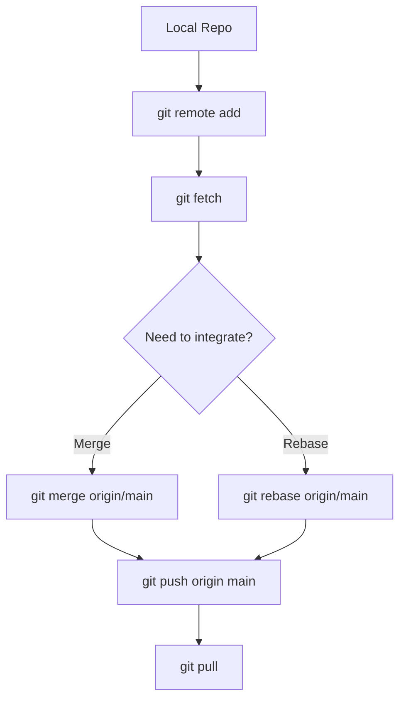

# MJ Command-Line — Documentation Hub

**Maintained by**: Sovereign Architect (MJ Ahmad)  
**Purpose**: To provide a step-by-step guide for deploying MJ smart contracts to Mainnet or Testnet environments

---

`Git Cheat Sheet`

## 🔑 Top 10 Daily Commands
```mermaid
1. `git init` — start a new repository  
2. `git clone <url>` — copy an existing repository  
3. `git add <file>` or `git add .` — stage changes  
4. `git commit -m "message"` — save changes with a message  
5. `git switch <branch>` — move between branches  
6. `git switch -c <branch>` — create a new branch  
7. `git log --oneline` — view compact commit history  
8. `git diff` — compare changes before committing  
9. `git push origin main` — send commits to remote  
10. `git pull` — fetch and merge changes from remote  
```
---

## 📈 Daily Workflow
```mermaid
flowchart TD
    A[git init / git clone] --> B[git add <file>]
    B --> C[git commit -m "message"]
    C --> D{Branching}
    D -->|Create| E[git switch -c <branch>]
    D -->|Switch| F[git switch <branch>]
    E --> G[git diff / git log --oneline]
    F --> G
    G --> H[git push origin main]
    H --> I[git pull]
```

---

## 🛠 Undo & Restore Workflow


---

## 🌍 Collaboration Workflow


---

### ✅ How to Use
- Place this file in your `docs/gh/` folder (e.g., `docs/gh/cheatsheet.md`).
- Add it to your `mkdocs.yml` navigation under `gh`.
- Enable **Mermaid diagrams** with `pymdownx.superfences` in your `mkdocs.yml`.

---

This page now gives a **one-stop Git reference**: the most-used commands, plus visual workflows for daily use, undoing mistakes, and collaborating with remotes.  

Next, prepare a **matching `.yml` nav entry** so this cheat sheet appears neatly under `gh` section in MKDocs